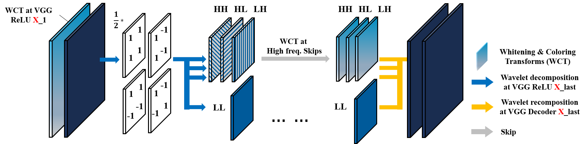

# WCT2
This repository contains PyTorch implementation of the paper [Photorealistic Style Transfer via Wavelet Transforms](https://arxiv.org/abs/1903.09760) and [Presentation on Photorealistic style transfer via WCT2](https://docs.google.com/document/d/1XXqfoJc23DFYfQnyIVZVKkxQ1gebP0vDyRa0_sZizDI/edit).
- Aditi Tiwari - 04301032019
- Rhythm- 05701032019

### Abstract 
We propose a wavelet corrected transfer based
on whitening and coloring transforms (WCT2) that allows
features to preserve their structural information and statistical
properties of VGG feature space during stylization.
This is the first and the only end-to-end model that can
stylize a 1024*1024 resolution image in 4.7 seconds, giving
a pleasing and photorealistic quality without any postprocessing.
Last but not least, our model provides a stable
video stylization without temporal constraints.

### Objective:
- Given a pair of images - S : Style image and C : Content image, perform photorealistic style transfer
- Leverage wavelet transform to overcome limitations of spatial distortions and introduction of unrealistic artifacts in the final image.
- Perform end-to-end photorealistic style transfer model that allows to remove the additional post-processing steps.
- The paper proposes to perform this via an end-to-end photorealistic style transfer model that allows to remove the additional post-processing steps.
- The model provides stable video stylization without temporal constraints. 

### Dataset
  - Images can be found in [DPST repo](https://github.com/luanfujun/deep-photo-styletransfer)

 

### Schematic illustration of wavelet module
 

### Results
<p float="left">
  
 
 
 </p>

### Installation
- Clone this repo:
```bash
git clone https://github.com/Adititiwari02/Photorealistic-Style-Transfer-AI-College.git
cd https://github.com/Adititiwari02/Photorealistic-Style-Transfer-AI-College.git
```

## How to run the code
```python
cd WCT2/src/
python main.py
```

  
### Arguments
- `--content`: FOLDER-PATH-TO-CONTENT-IMAGES
- `--content_segment`: FOLDER-PATH-TO-CONTENT-SEGMENT-LABEL-IMAGES
- `--style`: FOLDER-PATH-TO-STYLE-IMAGES
- `--style_segment`: FOLDER-PATH-TO-STYLE-SEGMENT-LABEL-IMAGES
- `--output`: FOLDER-PATH-TO-OUTPUT-IMAGES
- `--image_size`: output image size
- `--alpha`: alpha determines the blending ratio between content and stylized features

